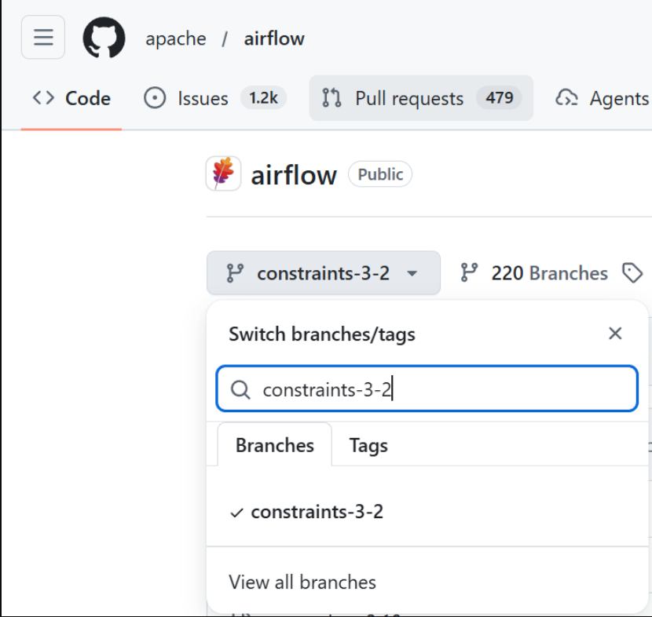
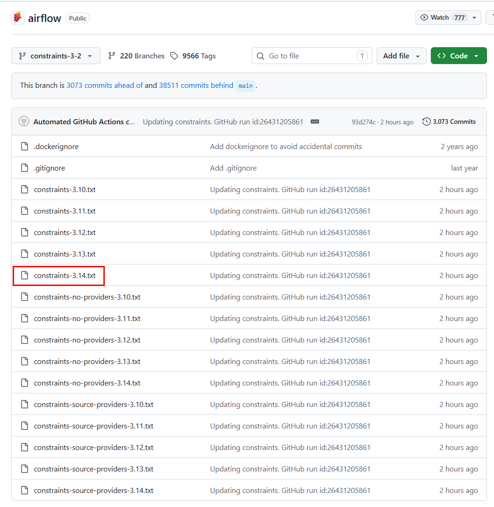
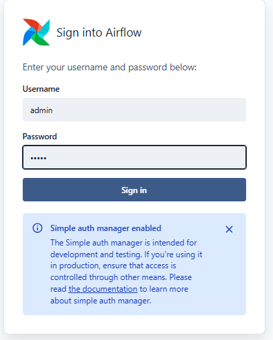

Airflow 설치 가이드 (로컬 개발 환경 - Standalone)
===

>  [!NOTE]
>  VirtualBox_설치가이드.md 문서 이후에 진행이 되어야 합니다 (로컬 PC 환경 기준).

## 설치 환경 및 목적
본 가이드는 **로컬(개인 PC)** 가상머신 환경에서 Airflow를 가장 빠르고 가볍게 테스트하기 위한 **Standalone(단일 구동) 환경** 구축을 목표로 합니다.

* **구동 분류**: 로컬 테스트 환경 (Local Environment)
* **Guest OS**: Ubuntu 26.04 (VirtualBox VM)
* **Python**: 3.14
* **Airflow**: 3.2
* **Metadata DB**: SQLite (Standalone 기본 내장 DB)
* **Executor**: Standalone (단일 태스크 순차 실행)


## Ubuntu 26.04 초기 설정 및 Python 3.14 가상환경 구축

> [!NOTE]
>   **주의 / 선택 사항**
> 일반 유저(***ubuntu***) 상태에서 ***sudo*** 명령어가 동작하지 않거나 권한 에러가 발생할 때만 진행하세요. (***기본적으로 권한이 있다면 건너뛰셔도 됩니다.***)
> 

```bash
su -
usermod -aG sudo ubuntu
exit
```

### 일반 유저(ubuntu) 상태에서 패키지 업데이트
``` bash

# 최신 패키지 업데이트 및 업그레이드
sudo apt update && sudo apt upgrade -y

# 필수 도구(네트워크 체크, 텍스트 에디터, SSH, pip, python3.14 가상환경) 설치
sudo apt install -y net-tools vim openssh-server pip python3.14-venv

python3 --version
# 출력 결과: Python 3.14.4
```

### Airflow 전용 가상환경(venv) 생성 및 셋업
```bash
1) Airflow 홈 디렉토리 환경설정 영구 등록
echo "export AIRFLOW_HOME=~/airflow" >> ~/.bashrc

2) 터미널창 종료 없이 즉시 적용
source ~/.bashrc

3) 정상적으로 경로가 잡혔는지 확인
echo $AIRFLOW_HOME
# 출력 결과: /home/ubuntu/airflow

4) 파이썬3.14 버전을 사용하기 위해 독립된 가상환경 방을 만듭니다.


# Ubuntu 26.04 공식 가이드 사이트에 글로벌 환경에서 "pip install" 설치를 금지하며
# "PEP 668","externally-managed-environment" 가상환경 사용을 강제하는 내용이 명시되어 있습니다

python3.14 -m venv ~/airflow_venv 
source ~/airflow_venv/bin/activate

5) Mini0, postgresql 사용을 위한 pip 설치
pip install --upgrade pip apache-airflow-providers-postgres psycopg2-binary apache-airflow-providers-amazon xmltodict s3fs
```

## Airflow 3.2.1 Install And Init Setup
 
[👉 Apache Airflow GitHub 바로가기](https://github.com/apache/airflow)  


화면 왼쪽 상단에 main 이라고 써진 버튼 클릭  
 3-2 입력 및 목록에서 constraints-3-2 를 찾아서 클릭




 파이썬 버전 3.14 



```bash
1) 3.2.1 전용 설치 URL 변수 지정
export CONSTRAINT_URL="https://raw.githubusercontent.com/apache/airflow/constraints-3.2.1/constraints-3.14.txt"

2) Airflow 설치 
pip install "apache-airflow==3.2.1" --constraint "${CONSTRAINT_URL}"

3) airflow 버전 확인
airflow version
# 출력결과: 3.2.1

4) airflow DAG 폴더 생성
mkdir -p ~/airflow/dags

5) Airflow 데이터를 메타데이터 DB에 최초 기록
airflow db migrate
```


## Airflow 3.2.1 환경 설정 환경 
```bash
1) Airflow 환경 설정 편집기 접근 
vim ~/airflow/airflow.cfg 

1. 연습 DAG 로드 비활성화

#load_examples = True
load_examples = False

2. 스케줄러 실행 기준 시간대를 한국(KST)으로 변경

#default_timezone = utc
default_timezone = Asia/Seoul


3. airflow 시스템 전체를 통틀어 동시에(Concurrently) 실행 상태(running)로 존재할 수 있는 태스크 인스턴스 32개 -> 10개 

#parallelism = 32
parallelism = 10

4. 하나의 Dag에 총 10개의 tasts만 가능 

#max_active_tasks_per_dag = 16
max_active_tasks_per_dag = 10

5. dags 디렉토리에 새 파일 발견은 15초 간격으로 파싱

#refresh_interval = 300 
refresh_interval = 15

6. dags 디렉토리에 기존 코드 수정은 10초마다 파싱
#min_file_process_interval = 30
min_file_process_interval = 10

6. dgas 디렉토리에 여러 파일을 수정 되었을때, 파싱 Worker 프로세서 설정 (Standalone은 병렬처리가 아니므로 하나면 충분하다) 

#parsing_processes = 2 
parsing_processes = 1


7. 편집기 수정 내용 저장 및 airflow Web 구동 
wq!

# Airflow 동작 
airflow standalone

```

### 새로운 터미널 창 오픈후 Web Ui 임시 관리자 패스워드 수정
```bash

 cat airflow/simple_auth_manager_passwords.json.generated
{"admin": "임시 패스워드"}

vim airflow/simple_auth_manager_passwords.json.generated
{"admin": "admin"}

크롬 브라우저에 Airflow Server IP OR DNS:8080 입력
ID: admin
Password: admin
``` 




&nbsp;

&nbsp;

&nbsp;


> [!NOTE]
> **중요 알림: Standalone 환경에서는 이 단계가 필요 없습니다.**
> 현재 가이드는 **로컬 Standalone 환경**이므로, Airflow에 기본 내장된 가벼운 **SQLite**를 메타데이터 DB로 사용합니다. 따라서 PostgreSQL을 추가로 설치할 필요가 없습니다.

### 환경별 메타데이터 DB 선택 가이드
* **로컬(개인 PC) standalone 환경**: 별도 DB 설치 필요 없음 ➡️ **SQLite 사용 (현재 단계 건너뛰기 가능)**


*(※ 향후 standalone 제약을 풀고 멀티 워커 병렬 처리를 연동해보고 싶다면 아래의 PostgreSQL 설치 및 메타데이터 셋업 과정을 진행하시기 바랍니다.)*


```bash
# PostgreSQL 엔진 설치
sudo apt install -y postgresql postgresql-contrib

psql --version
# 출력결과: psql (PostgreSQL) 18.3 (Ubuntu 18.3-1)
```

## Airflow 메타데이터 RDBMS 생성 및 셋업
PostgreSQL 관리자 계정으로 접속하여, Airflow 엔진이 사용할 독립된 데이터베이스 스키마와 접근 계정을 생성하고 권한을 부여합니다.

```bash

1. postgres 마스터 계정으로 전환하여 SQL 콘솔(psql) 진입

sudo -i -u postgres psql;

-- 2. 에어플로우 전용 계정 생성 (계정명: airflow / 비밀번호: airflow)
CREATE USER airflow WITH PASSWORD 'airflow';
출력결과: CREATE ROLE

-- 3. 메타데이터를 저장할 독립된 데이터베이스 생성 (DB명: airflow)
CREATE DATABASE airflow;
# 출력결과: CREATE DATABASE

-- 4. airflow 계정이 airflow 데이터베이스 소유주가 되어 "DB"와 "테이블" crud를 모두 할 수있다 
ALTER DATABASE airflow OWNER TO airflow;
ALTER DATABASE

-- 5. airflow DB 안 "테이블" 만 헨들링이 필요한 유저에 권한을 넣어줄 수 있다  
GRANT ALL PRIVILEGES ON DATABASE airflow TO airflow; {테이블 crud 권한이 필요한 DB 접근 유저};
출력결과: GRANT


postgres=# \l
                                                     List of databases
   Name    |  Owner   | Encoding | Locale Provider |   Collate   |    Ctype    | Locale | ICU Rules |   Access privileges
-----------+----------+----------+-----------------+-------------+-------------+--------+-----------+-----------------------
 airflow   | airflow  | UTF8     | libc            | en_US.UTF-8 | en_US.UTF-8 |        |           | =Tc/airflow          +
           |          |          |                 |             |             |        |           | airflow=CTc/airflow
 postgres  | postgres | UTF8     | libc            | en_US.UTF-8 | en_US.UTF-8 |        |           |
 template0 | postgres | UTF8     | libc            | en_US.UTF-8 | en_US.UTF-8 |        |           | =c/postgres          +
           |          |          |                 |             |             |        |           | postgres=CTc/postgres
 template1 | postgres | UTF8     | libc            | en_US.UTF-8 | en_US.UTF-8 |        |           | =c/postgres          +
           |          |          |                 |             |             |        |           | postgres=CTc/postgres
(4 rows)


-- 5. 콘솔 탈출
\q

# 외부에서 접근 가능하도록 설정
 "172.0.0.1" 은 내 로컬 pc에서만 가능하지만 외부에서도 접근을 이용하게 하기 위해 위험하지만 테스트용으로 0.0.0.0으로 잡아줬다 
sudo ss -tlpn | grep 5432    
[sudo: authenticate] Password:
LISTEN 0      200        "127.0.0.1:5432"      0.0.0.0:*    users:(("postgres",pid=44794,fd=7))
LISTEN 0      200            [::1]:5432         [::]:*    users:(("postgres",pid=44794,fd=6))

sudo vim /etc/postgresql/18/main/postgresql.conf

60 #listen_addresses = 'localhost'
61 listen_addresses = '*'

sudo vim /etc/postgresql/18/main/pg_hba.conf
# 맨 마지막 라인에 추가
host    all             all             0.0.0.0/0               scram-sha-256

4. 포스트그레스 깨우기 (재시작)
Bash
sudo systemctl restart postgresql

## 127.0.0.1:5432 -> 0.0.0.0 으로 변경 완료
sudo ss -tlpn | grep 5432
LISTEN 0      200          0.0.0.0:5432      0.0.0.0:*    users:(("postgres",pid=46135,fd=6)) 
LISTEN 0      200             [::]:5432         [::]:*    users:(("postgres",pid=46135,fd=7))
```
