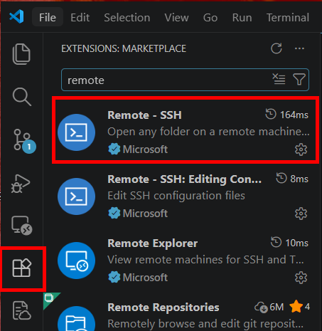
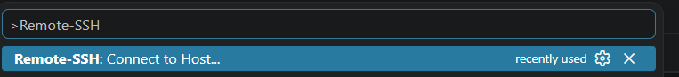
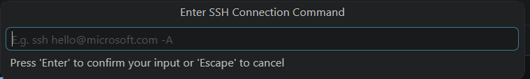
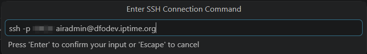
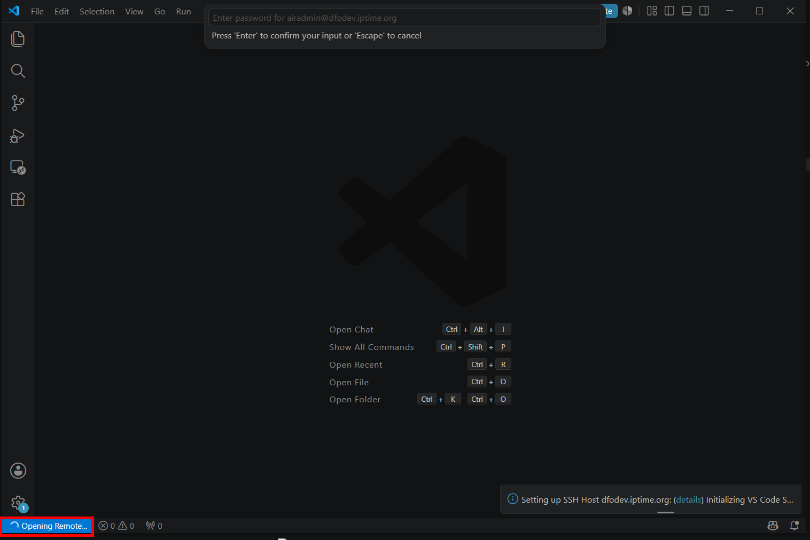
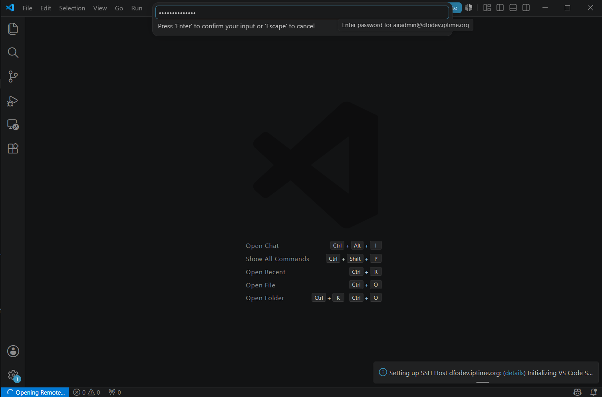
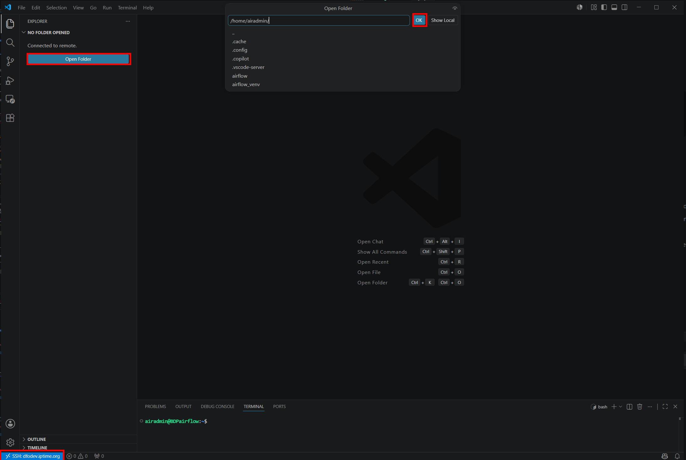
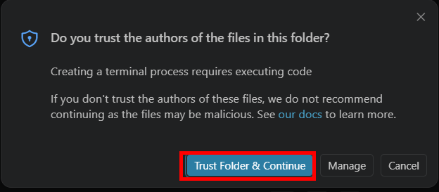
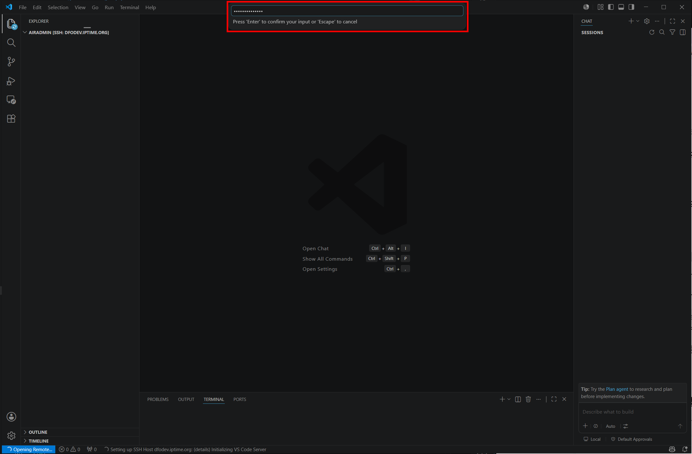
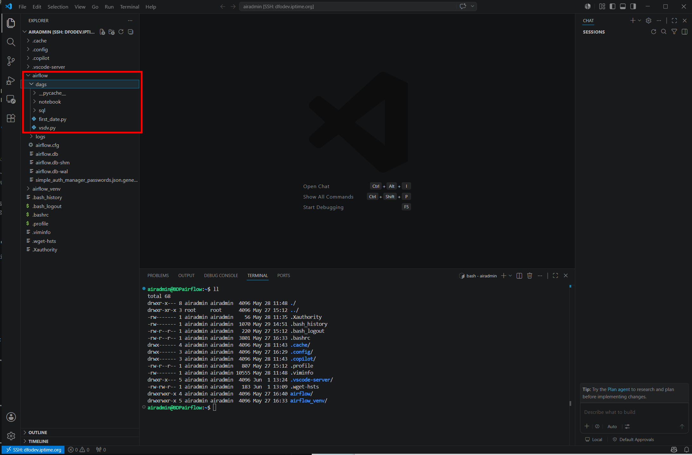

# Airflow 1차 I/F SFTP 배포가이드 

> [!NOTE]
> 1차 I/F DAG 파일 배포가이드 입니다.  
> 시중에 다양한 SFTP 프로토콜 기반 파일 전송 방식이 존재하나, 본 가이드에서는 파일 전송의 안정성과 보안성을 극대화하기 위해 Microsoft(MS)에서 직접 검증하고 관리하는 **VS Code Remote - SSH** 방식을 채택하였습니다. 검증된 서드파티 및 공식 도구를 활용함으로써 전송 오류를 최소화하고 안정적인 1차 파일 배포 환경을 구축하고자 합니다.

> [!WARNING]
> **배포 시 주의사항 (덮어쓰기 위험)**
> 현재 1차 빌드 목적의 direct 배포 방식 특성상, 동일한 DAG 파일명으로 업로드 시 기존 동작 중인 파일이 Overwrite 됩니다. 기존 소스 유실에 주의하시기 바랍니다.

**VScode 에서 Remote -SSH 패키지 설치**  

**Ctrl + Shift + P 입력 후 ">Remote-SSH" 입력**  

**12시 방향에 나온 검색창을 아래 예시에 맞춰 입력**  

**SSH 명령어 매개변수 예시**  
> ssh -p [포트번호] [원격지_계정명]@[원격지_IP_또는_도메인]
- **Port**: 2222
- **Remote Server User ID** : airflow
- **Remote Server Host ID or IP** : 192.168.0.100

> ssh -p 2222 airflow@192.168.0.100

**패스워드 입력 후 Enter**   

**좌측 폴더 오픈 선택 및 경로 지정**   

**Remote 서버 패스워드 재입력**

