# VirtualBox + Ubuntu 26.04 설치

## 설치 환경
> [!Note] Ubuntu 26.04 Server 권장 리소스 입니다 추후 Airflow 설치 이후 동작에 끊김이 인다면 본인 PC 리소스에 맞게 리소스를 올려 주시면 됩니다 

* **프로그램** :VirtualBox-7.2.8  
* **OS** : Ubuntu 26.04 Server
* **CPU** : 2
* **Memory** : 2GB
* **Hard** : 20GB

## 설치 URL
VirtualBox 설치 파일 URL
> https://www.virtualbox.org/wiki/Downloads

Ubuntu 26.04 설치 파일 URL 
> https://releases.ubuntu.com/26.04/

## Virtual Box Install

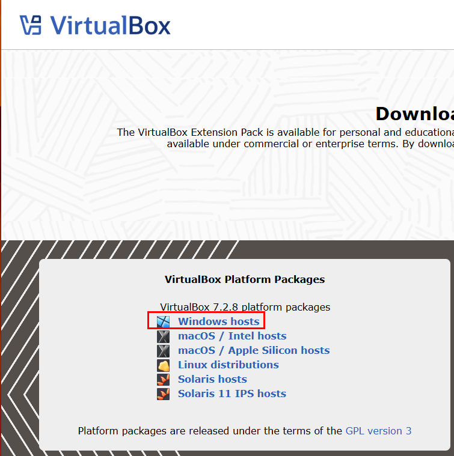

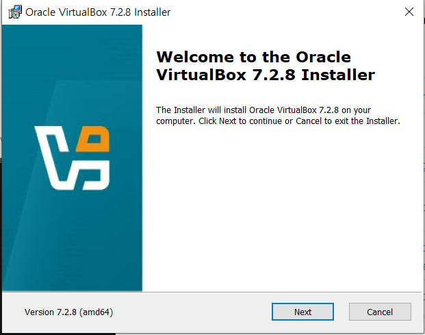

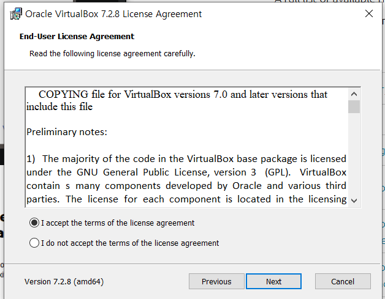

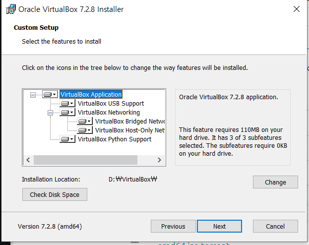

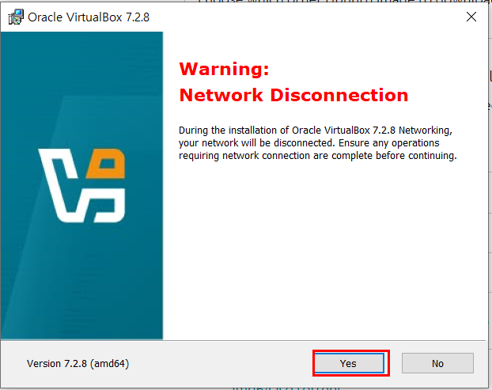

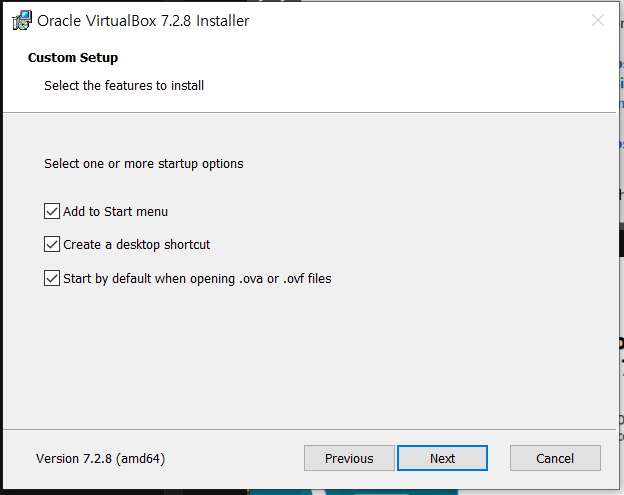
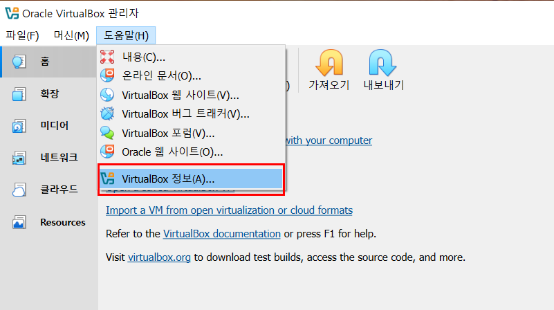
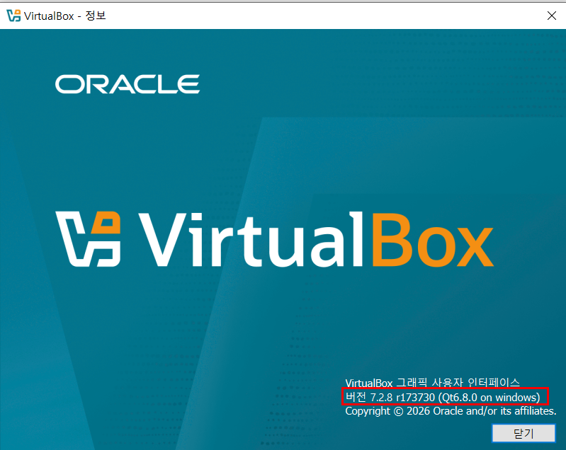

## Ubuntu 26.04 Server 
> **선택 사항**
>
> 리소스를 줄이기 위해 Server 버전을 선택 하였고, GUI가 보이지 않습니다 GUI가 필요하면 "Server" 가 아닌 "Desktop" 버전으로 다운 받으셔야 합니다 

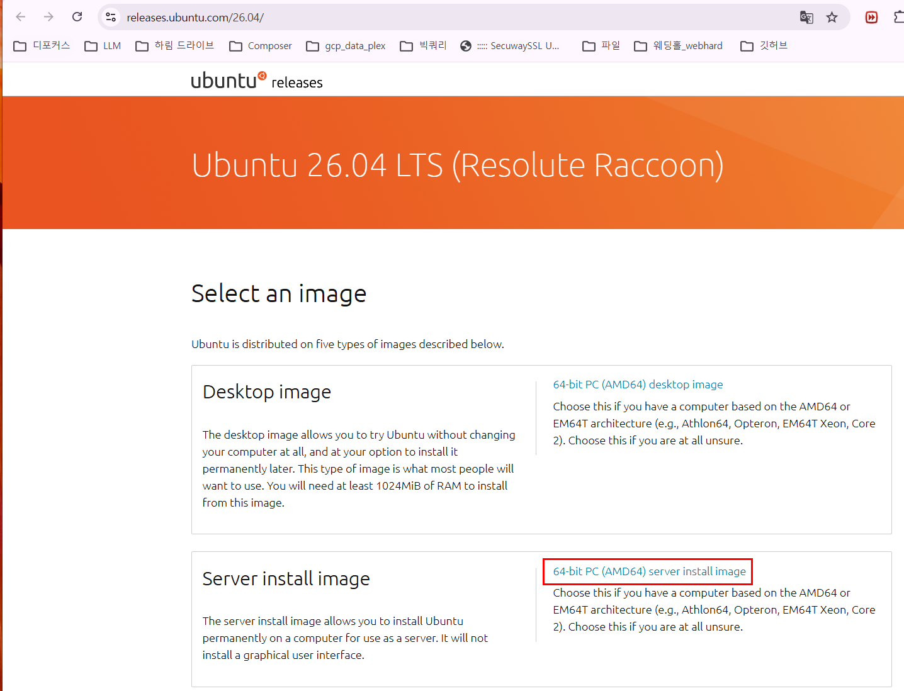

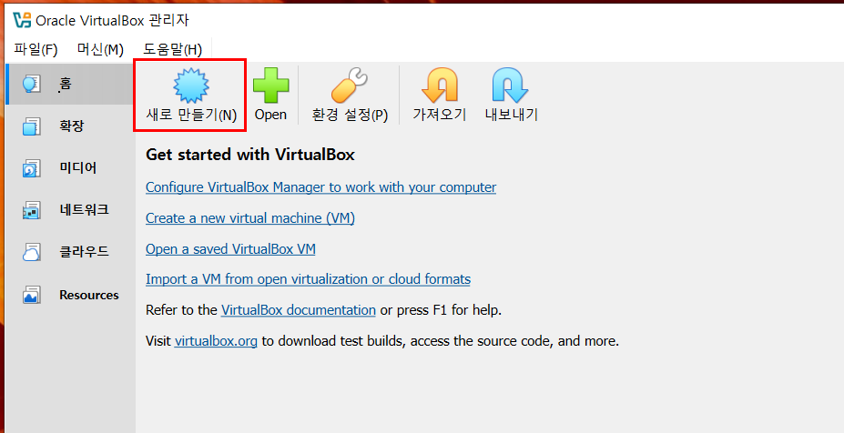

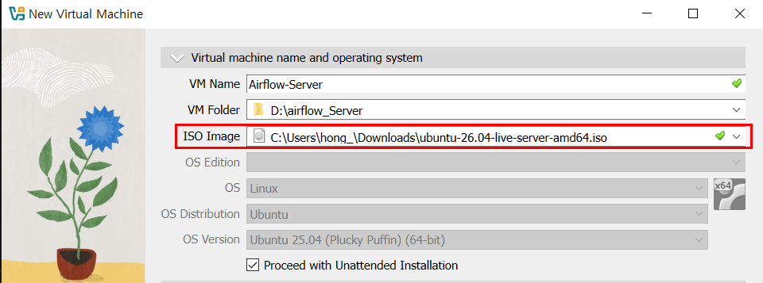
 초기 계정, 패스워드 ubuntu / ubuntu 
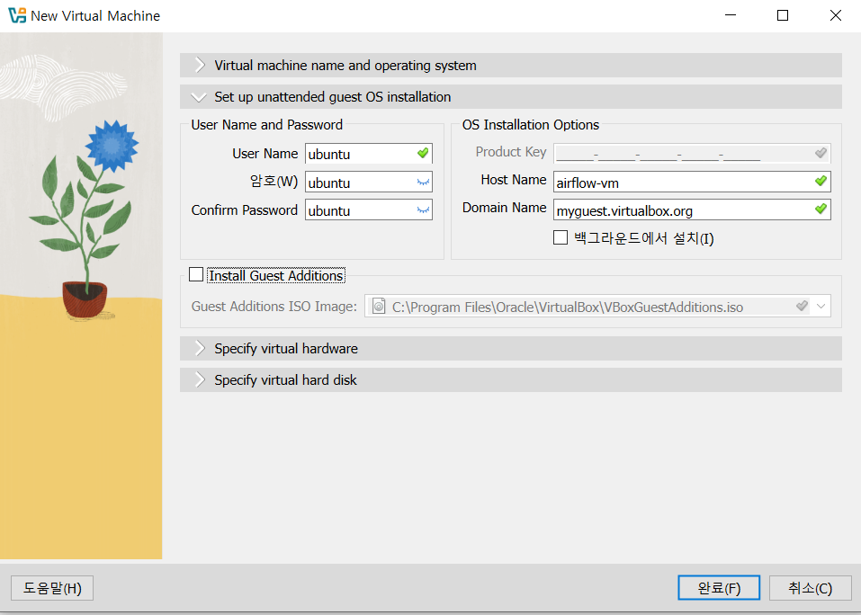
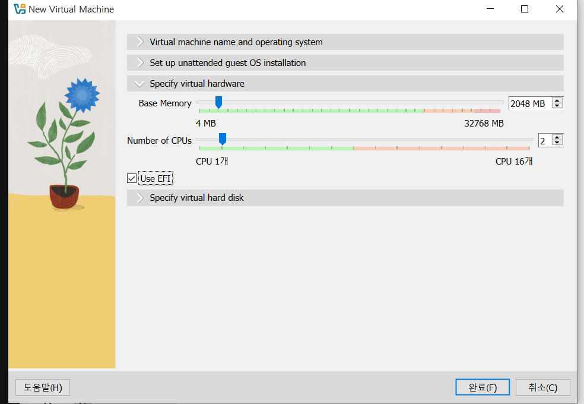
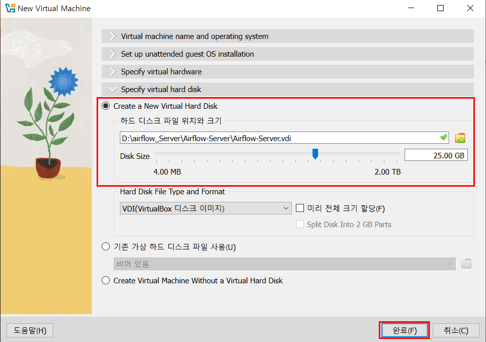

좌측 **Airflow-Server** 인스턴스 더블클릭

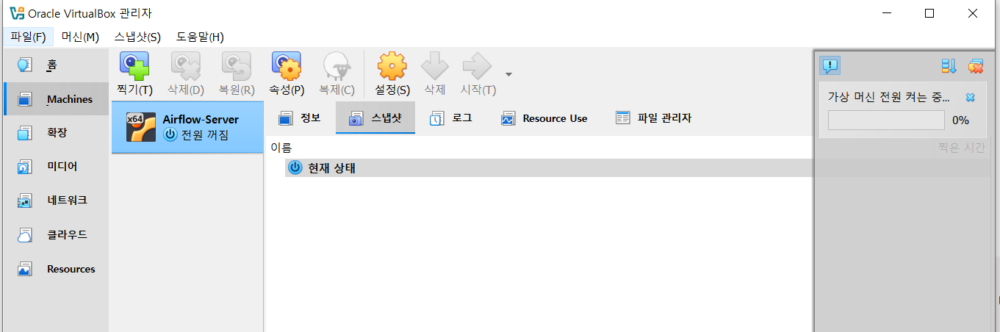

Ubuntu 26.04 실행 확인

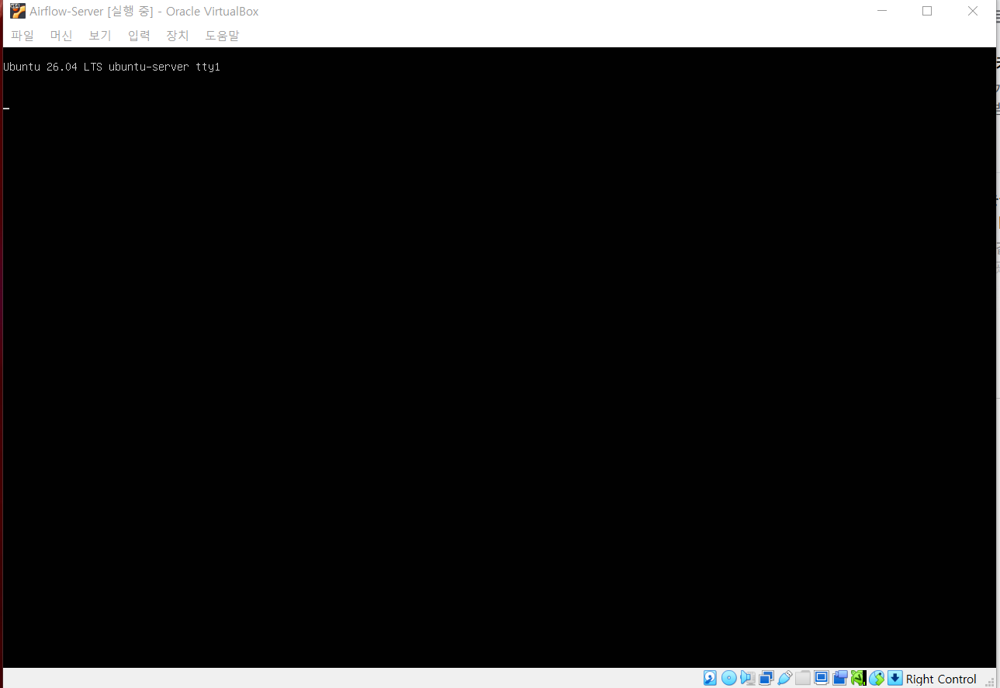

ubuntu / ubuntu 입력 

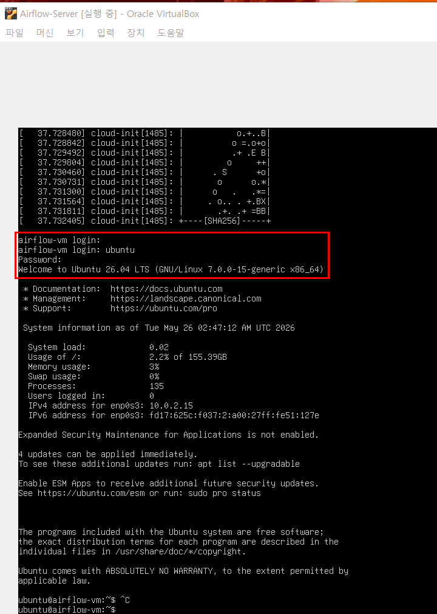

실행중인 리눅스 서버 시스템 종료 후 우클릭, 실행 클릭 

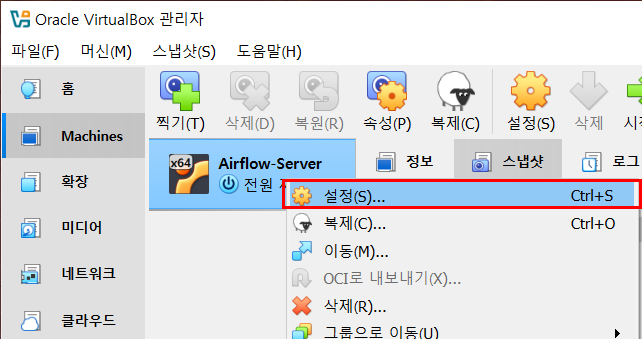

네트워크 -> 어댑터 2 (호스트 전용 어댑터 활성화) 후 서버 재실행

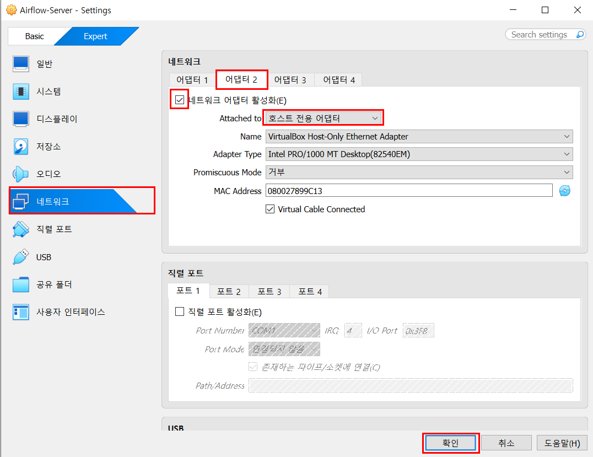

ip a 명령 후 **enp0s8: 192.168.56.x/24** 대역 확인  

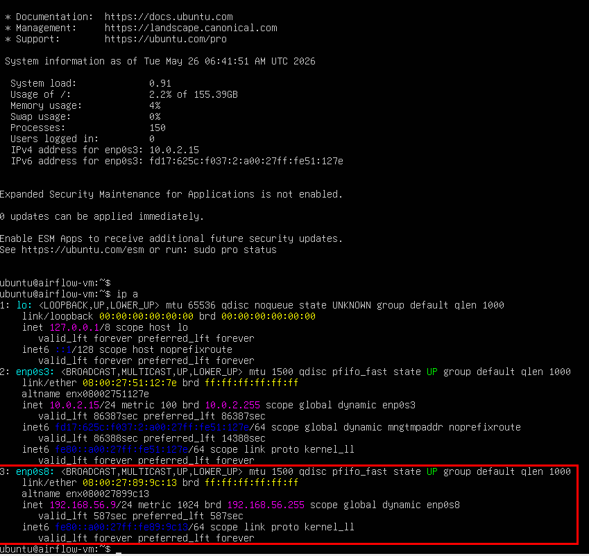

